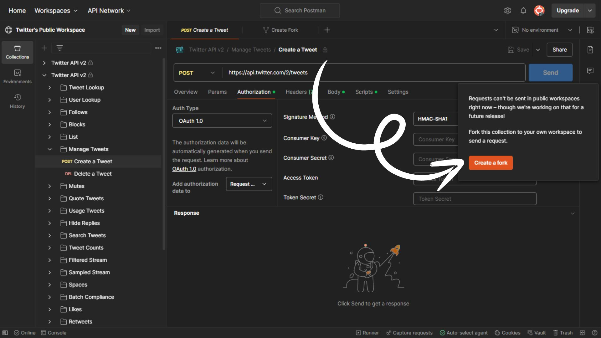
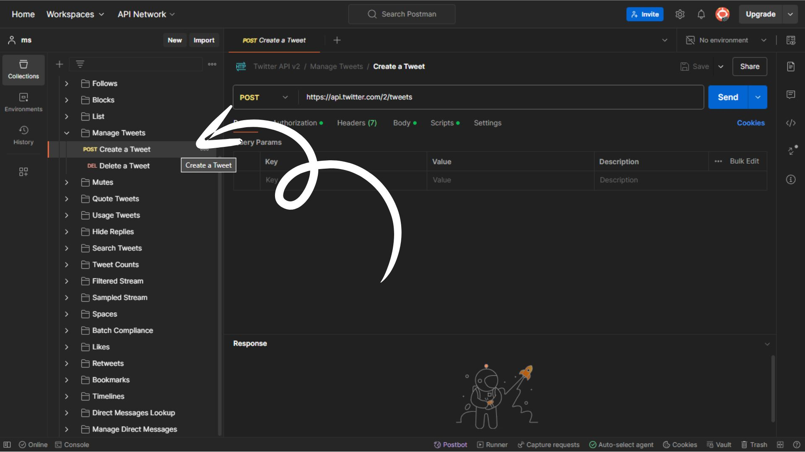
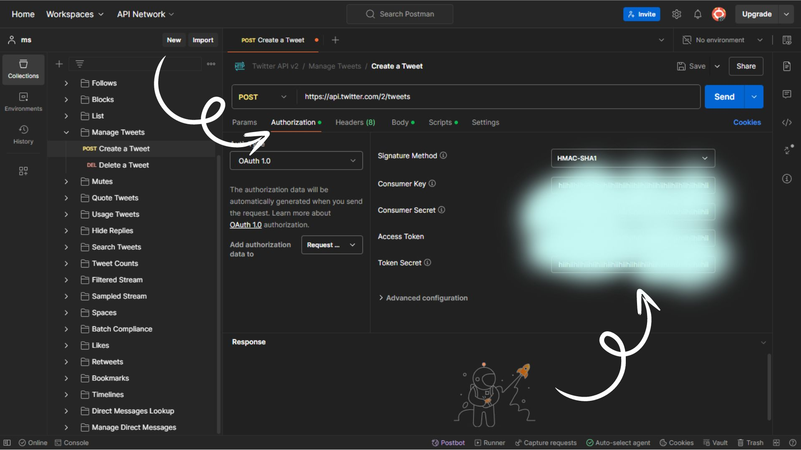
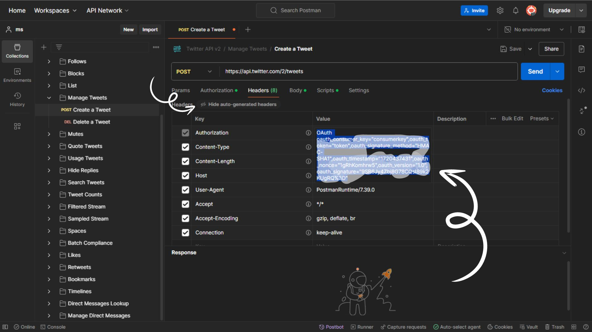

<h1 align="center">Controversial Tweeter 🐦</h1>

<p align="center">
   
</p>

> [!NOTE]
>
> Welcome to Controversial Tweeter, an automated script that leverages AI language models to generate and post content on Twitter every 2 days. This project demonstrates how to integrate OpenAI's language model (LLAMA3 via MindsDB endpoint) with the Twitter API using JavaScript.

> [!TIP]
>
> #### 🙋‍♀️ How It Works
>
> The script uses OpenAI's SDK to communicate with MindsDB's endpoint, where the LLAMA3 model resides. It fetches generated content and interacts with the Twitter REST API using `fetch` to post tweets at regular intervals.

---

## 🥪 Tech Stack

- **JavaScript** (Node.js)
- **OpenAI** SDK for LLAMA3 integration powered by **Minds DB**
- Fetch API for **Twitter API** interaction

## 🍗 Initializing

> To run the script, you need to set up two environment variables either in a **[`.env`](.env.example)** file or as GitHub secrets:

```dotenv
# YOUR AI MODEL / MINDSDB ENDPOINT API KEY
AI_API_KEY="<obtained from MDB.AI dashboard>"

# YOUR X OAUTH ENCRYPTED HEADER
OAUTH_HEADER="<follow steps below to obtain>"
```

### 🍎 Obtaining Environment Variables

##### 1. **API Key from MindsDB:**

- Create a free account at **[MindsDB](https://mdb.ai/)**

- Obtain your API key from the dashboard.

#### 2. **OAuth Header for Twitter API:**

| **Step 1:-** Go To **[`X Postman Workspace`](https://www.postman.com/xapidevelopers/workspace/twitter-s-public-workspace/request/9956214-5bd6ebb1-9d79-4456-a9a6-22ead4a41625)** |
| -------------------------------------------------------------------------------------------------------------------------------------------------------------------------------- |
|                                                                                                                                                       |

| **Step 2:-** After forking workspace, open your fork and go to `Manage Tweets -> Create a Tweet` |
| ------------------------------------------------------------------------------------------------ |
|                                                                       |

| **Step 3:-** Head to `Authorization` Tab and fill up neccessary keys and secrets that you would get from X Developer Portal |
| --------------------------------------------------------------------------------------------------------------------------- |
|                                                                                                  |

| **Step 4:-** Go to `Headers` Tab, copy `Authorization` header value (ensure you can view Hidden Headers) |
| -------------------------------------------------------------------------------------------------------- |
|                                                                               |

---

## 🍕 Contributing

> **Your contributions are welcome! Here’s how you can contribute:**

1. **Star the Repository:** ⭐️
   Show your support by starring the repo.

2. **Raise Pull Requests (PRs):**
   - Fork the repository.
   - Make your changes in a separate branch.
   - Open a pull request with a detailed description of your changes.

---

> [!CAUTION]
>
> This repository is purely for entertainment purposes. It does not promote controversial or racial thoughts. The use of AI language models and the content generated are intended for fun and educational demonstrations only.

---

<p align="center"> <strong> 🌟 Give this repo a star 🌟 </strong> </p>
